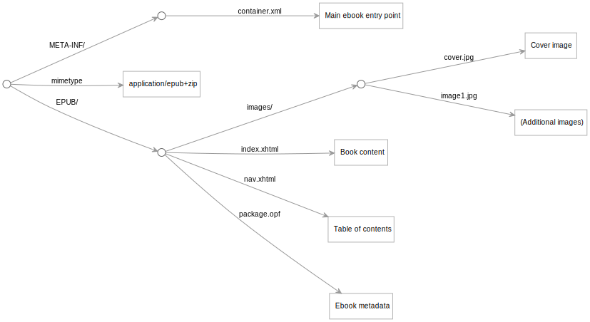

This project explores using the [Origami](https://weborigami.org/language) language to create an ebook in the [EPUB](https://en.wikipedia.org/wiki/EPUB) format: a travel diary of a month-long hike across Japan in 2023.

## Download the book

Download the file: [japan-hike.epub](https://github.com/WebOrigami/japan-hike-ebook/raw/main/japan-hike.epub)

This can be opened in book readers like Apple Books or Calibre, or you can [send it to a Kindle](https://www.amazon.com/sendtokindle) reader.

## How the book is built

Generally speaking, an EPUB file is a ZIP file containing a specific set of files. These files define things such as book metadata (title, author, etc), a table of contents, and XHTML pages for the chapter contents.

Origami is good for defining trees of content like this, so should be a reasonable way to programmatically generate an ebook in EPUB format. This project explores this idea to create a simple book based on a travel diary of a hike across Japan.

The `content` folder represents what the author creates:

- The `book.yaml` file contains book metadata.
- The `images` subfolder contains images for the book.
- The `markdown` subfolder contains markdown files for a number of stories; each file will become a chapter.

The core [src/ebook.ori](./src/ebook.ori) Origami file uses the above to define the complete tree of files necessary for the EPUB format, including:

- Translating the markdown to HTML
- Combining the chapters into an overall XHTML file
- Resizing images
- Generating a manifest that identifies all the chapters and images

The complete virtual tree looks like this:



To create a readable ebook, that virtual tree of files is compressed into ZIP format and saved as an `.epub` file.

## Rebuilding the ebook

After cloning, run:

```console
$ npm install
```

To preview the files that will go into the ebook:

```console
$ npm run preview
```

This will regenerate the `preview` folder and show everything that will go into the EPUB file.

To view the files in a browser:

```console
$ npm run start
```

You can then browse the generated, virtual files like `EPUB/nav.xhtml`.

To build the ebook:

```console
$ npm run build
```

This will regenerate the `japan-hike.epub` file that you can open in an ebook reader.

## License

The Software here (the Origami program) is licensed via MIT License; see the LICENSE file.

The book content (the text and images) is copyright 2024 Jan Miksovsky. All rights reserved. You may make copies of this book for personal use, but may not distribute it or use it for commercial purposes without permission.
